# BACKEND EQUIPO VERDE

## ✅ GET/:id
Ejemplo de uso para obtener informacion de un solo formulario con la id en el navegador y en postman usando **GET** para todos los formularios para denotar la diferencia
`GET:id = api/permisos-materiales/4` {Send}

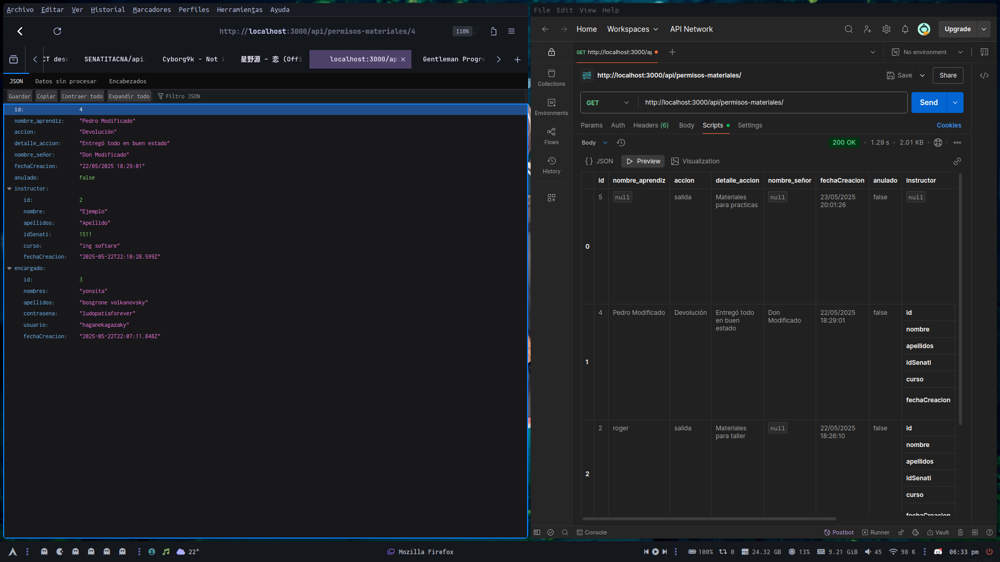

## ✅ PUT
Ejemplo de uso para editar informacion de un solo formulario con la id en postman usando **PUT** primero vamos a `Headers` y agregamos `{Key = Content-Type} {Value = aplication/json}`, luego en `Body` marcar `raw` para editar el json asi :
```json
{
  "nombre_aprendiz": "Sideral Luján Carreón",
  "accion": "Jugar Dota"
}
```
Finalmente agregar la id del formulario a editar `PUT:id = api/permisos-materiales/4` {Send}

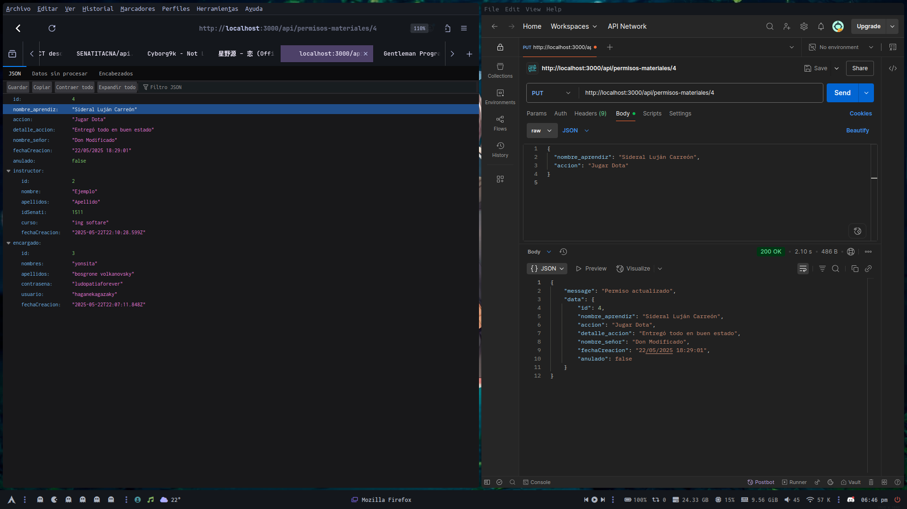

## ✅ PATCH 
Ejemplo de uso para anular un solo formulario con la id en postman usando **PATCH** solo `anular/:id = api/permisos-materiales/anular/4` {Send} y el formulario se anularia como se ve en el navegador el formulario no se muestra por que se configuro para que solo se muestren los formularios no anulados, en el segundo postman usando *GET* para filtra los formularios que estan anulados con la `query = api/permisos-materiales?anulado=true`

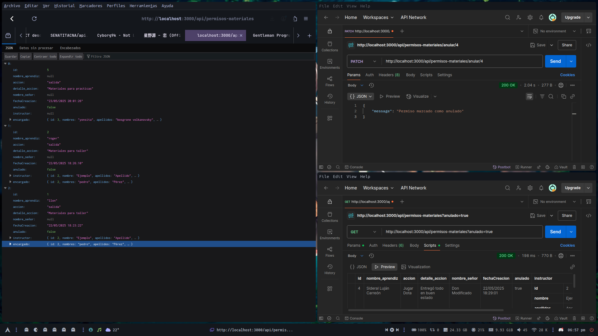

Ejemplo de uso para desanular un solo formulario con la id en postman usando **PATCH** `desanular/:id = api/permisos-materiales/desanular/4` {Send} y el formulario se desanularia, como se ve en el navegador el formulario ya se muestra por que sale `anulado=false` eso quiere decir que el formulario no esta anulado, en el segundo postman responde `[]` a la filtracion de formularios anulados por que no hay un solo formulario anulado 

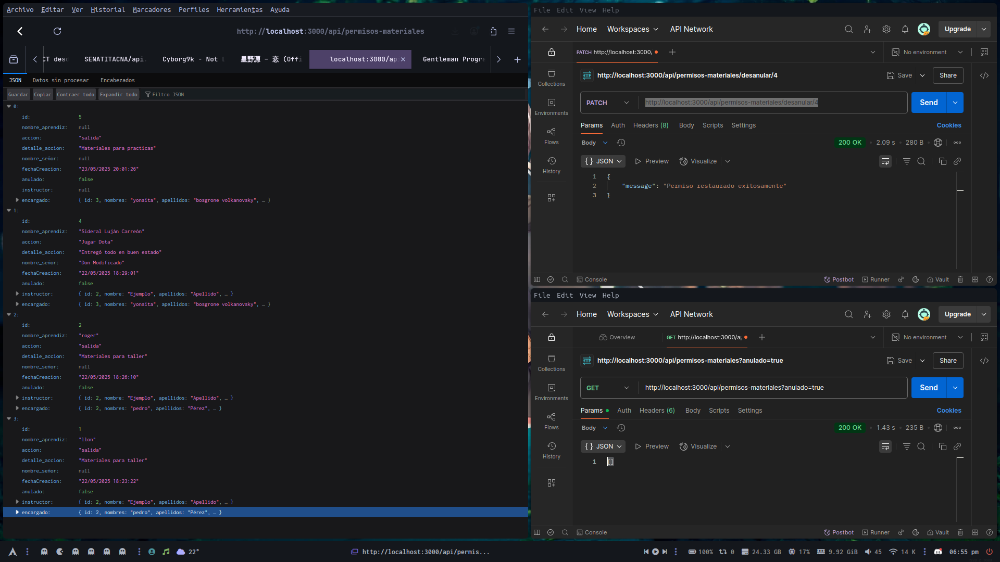

# ❌ DELETE

**NO ES RECOMENDADO ELIMINAR UN FORMULARIO DE LA BASE DE DATOS, AUNQUE EL CODIGO PARA EMILINAR UN FORMULARIO POR ID SIGUE AHI SE ESPERA USAR UN SOFT DELETE CON EL METODO PATCH PARA ANULAR UN FORMULARIO** 

---

--#Guia uso de APIS => registros (POST) formularios permisos:
BASE URL DE LA API: https://formbackend-ndvy.onrender.com

endpoint : /api/permisos-aprendices

estructura ejemplo JSON que espera el endpoint:
```json
{
  "nombres": "Carla",
  "apellidos": "peña",
  "ocupacion": "Estudiante",
  "grupo": "A-2023",
  "programa": "Electricidad",
  "motivo": "Consulta médica",
  "hora_salida": "14:00",
  "hora_retorno": "16:30",
  "tiempo_permiso": "02:30",
  "encargadoId": 3
}
```
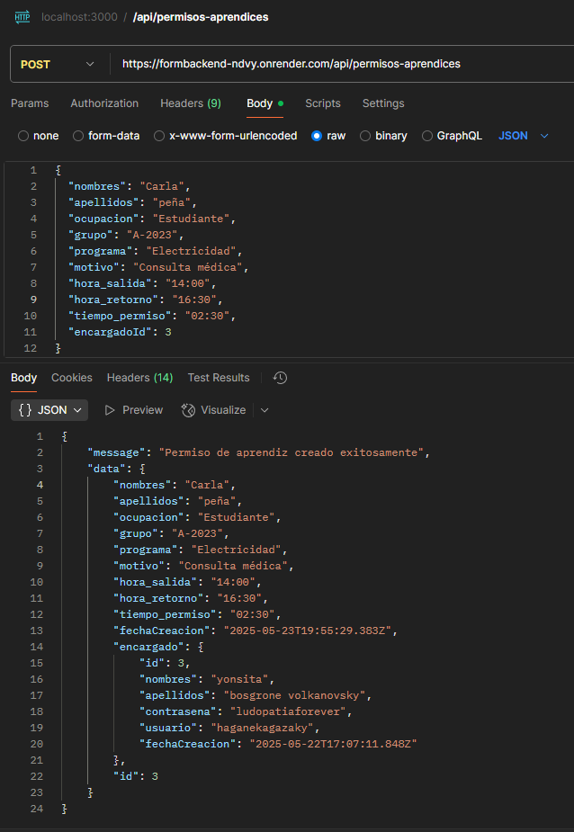


endpoint : /api/permisos-materiales

estructura ejemplo JSON que espera el endpoint:
```json
{
  "nombre_aprendiz": "gilberto",
  "accion": "salida",
  "detalle_accion": "Materiales para practicas",
  "id_senati": "",  
  "nombre_señor": "",
  "encargadoId": 3        
}
```
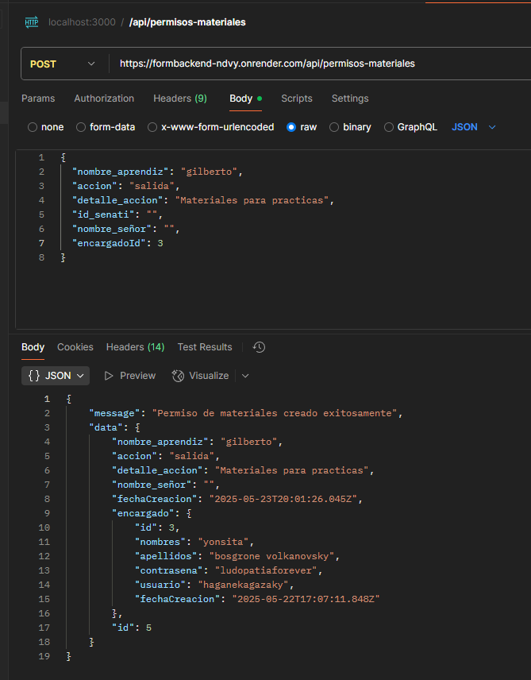  


endpoint : /api/permisos-instructores

estructura ejemplo JSON que espera el endpoint:
```json
{
  "idSenati": "1511",
  "apellidos": "Gómez",
  "dependencia": "TI",
  "cargo": "Docente",
  "hora_salida": "14:00",
  "hora_regreso": "16:00",
  "motivo": "problemas de salud",
  "detalle_motivo": "sintomas de malestar",
  "encargadoId": 3
}
```

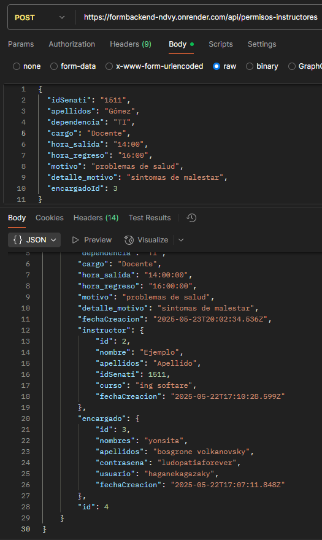


# BACKEND EQUIPO VERDE

## 👉 Guía de Uso de APIs - Formularios de Permisos

**Base URL de la API:**  
`https://formbackend-ndvy.onrender.com`

---

## 📌 POST - Registrar Formularios

### 📄 Permiso de Aprendiz

**Endpoint:**  
`/api/permisos-aprendices`

**Ejemplo de JSON:**
```json
{
  "nombres": "Carla",
  "apellidos": "Peña",
  "ocupacion": "Estudiante",
  "grupo": "A-2023",
  "programa": "Electricidad",
  "motivo": "Consulta médica",
  "hora_salida": "14:00",
  "hora_retorno": "16:30",
  "tiempo_permiso": "02:30",
  "encargadoId": 3
}
```
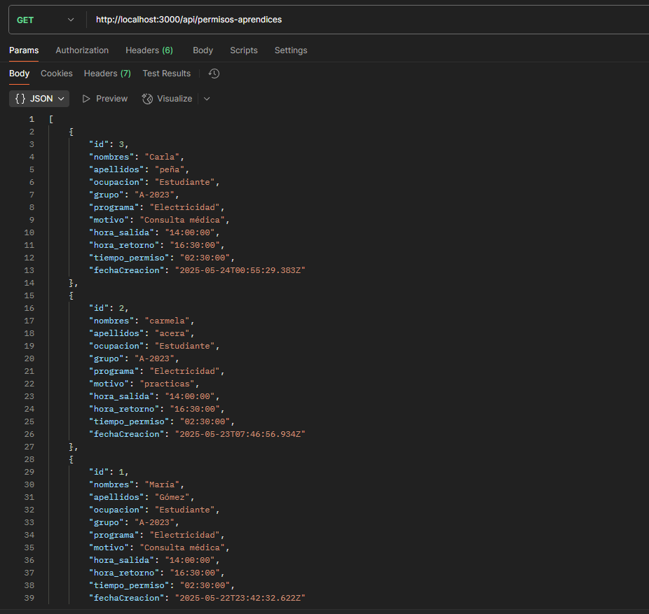


### 📄 Permiso de Materiales

**Endpoint:**  
`/api/permisos-materiales`

**Ejemplo de JSON:**
```json
{
  "nombre_aprendiz": "Gilberto",
  "accion": "salida",
  "detalle_accion": "Materiales para prácticas",
  "id_senati": "",  
  "nombre_señor": "",
  "encargadoId": 3
}
```
### 📄 Permiso de Instructores

**Endpoint:**  
`/api/permisos-instructores`

**Ejemplo de JSON:**
```json
{
  "idSenati": "1511",
  "apellidos": "Gómez",
  "dependencia": "TI",
  "cargo": "Docente",
  "hora_salida": "14:00",
  "hora_regreso": "16:00",
  "motivo": "Problemas de salud",
  "detalle_motivo": "Síntomas de malestar",
  "encargadoId": 3
}
```
---

## 📌 GET - Consultar Formularios

### 📄 Permiso de Aprendiz

**Endpoint:**  
`/api/permisos-aprendices`

**Parámetros opcionales de filtro:**
- `nombre`
- `apellidos`
- `fecha` (formato `YYYY-MM-DD`)

**Ejemplo de uso:**  
`/api/permisos-aprendices?nombre=carla&fecha=2025-05-23`

---
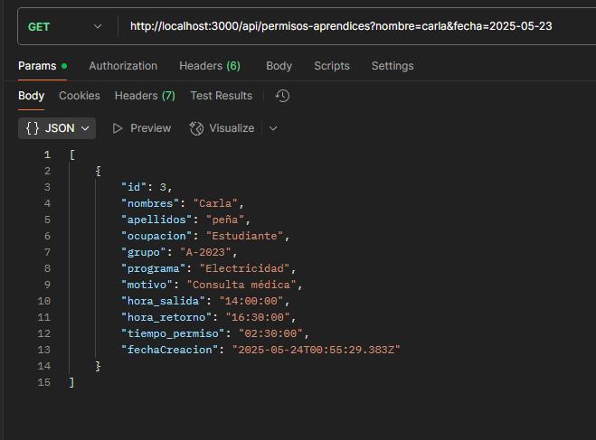

### 📄 Permiso de Materiales

**Endpoint:**  
`/api/permisos-materiales`

**Parámetros opcionales de filtro:**
- `id`
- `nombre_aprendiz`
- `nombre_señor`
- `accion`
- `id_senati`
- `fecha` (formato `YYYY-MM-DD`)

**Ejemplo de uso:**  
`/api/permisos-materiales?nombre_aprendiz=llon&accion=salida`
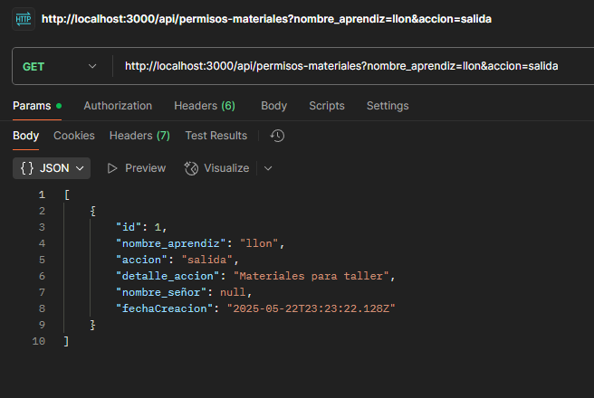
---

### 📄 Permiso de Instructores

**Endpoint:**  
`/api/permisos-instructores`

**Parámetros opcionales de filtro:**
- `id_senati`
- `apellidos`
- `fecha` (formato `YYYY-MM-DD`)

**Ejemplo de uso:**  
`/api/permisos-instructores?id_senati=1511`
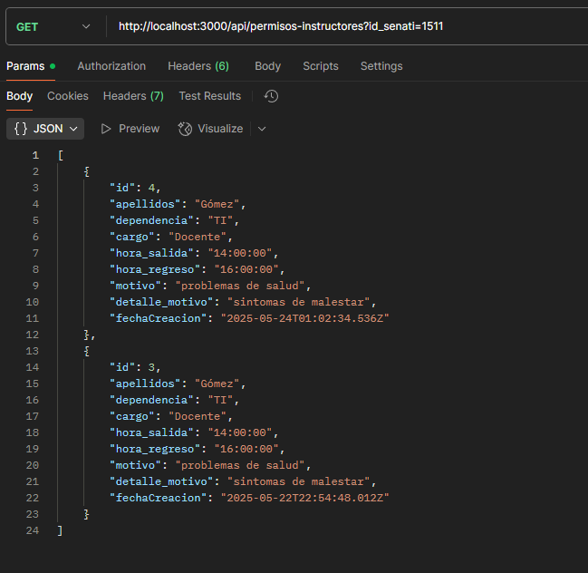
---

## 📝 Notas

- Todos los formularios deben incluir un `encargadoId` válido.


- **Autocompletado de instructores**
- **Validación de encargados**

---

## 🔍 1. Autocompletado de Instructores

### 📌 Endpoint

GET /api/instructores/autocompletar?query=valor

### 📝 Descripción

Este endpoint permite buscar instructores cuyo nombre, apellido o ID Senati empiecen con el valor ingresado en `query`.

### ⚙️ Parámetros

| Nombre | Tipo   | Requerido | Descripción                              |
|--------|--------|-----------|------------------------------------------|
| query  | string | ✅ Sí     | Cadena parcial que se desea autocompletar |

### 📤 Ejemplo de solicitud

GET /instructores/autocompletar?query=Al

### ✅ Ejemplo de respuesta
```json
[
  {
    "id": 1,
    "nombre": "Alberto",
    "apellidos": "Gómez",
    "idSenati": "11023",
    "curso": "Programación",
    "fechaCreacion": "2024-03-10T15:00:00.000Z",
    "encargado_id": 2
  },
  {
    "id": 5,
    "nombre": "Alonso",
    "apellidos": "López",
    "idSenati": "11045",
    "curso": "Redes",
    "fechaCreacion": "2024-04-01T10:00:00.000Z",
    "encargado_id": 3
  }
]
```
### 🔎 Detalles técnicos

- Se usa `ILIKE 'query%'` para que solo coincidan nombres, apellidos o IDs que empiecen con el texto.
- Se devuelven como máximo **10 resultados**, ordenados por **apellidos**.

---

## ✅ 2. Validación de Encargado

### 📌 Endpoint

POST api/encargados/login

### 📝 Descripción

Este endpoint verifica si las credenciales de un encargado (usuario y contraseña) son válidas.

### 📥 Body esperado (JSON)
```json
{
  "usuario": "encargado1",
  "contrasena": "123456"
}
```
### 📤 Ejemplo de respuesta exitosa
```json
{
    "message": "Inicio de sesión exitoso",
    "accesso": true,
    "id": 2,
    "nombres": "pedro",
    "apellidos": "Pérez"
}
```
### ❌ Ejemplo de respuesta con error
```json
{
  "message": "Usuario o contraseña incorrectos",
  "accesso": false
}
```
### o este en caso de que no ingrese algun campo

```json
{
    "message": "Usuario y contraseña son obligatorios",
    "accesso": false
}
```
---
